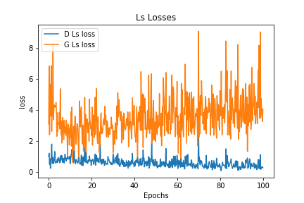

## Vanilla GANs

### Result 

Mnist 100eps

## Semi-supervised GANs

### Result 
Mnist 20eps

## Conditional GANs

### Result

## Auxiliary Classifier GANs

### Result

CIFAR-10 100eps

Auxiliary Classifier Accuracies

Lc Losses

Ls Losses

Entire Losses

